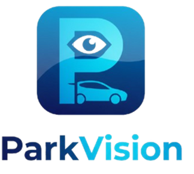

<p align="center">
  
</p>

<h1 align="center">🚗 ParkVision</h1>

<p align="center">
  <strong>Bilgisayar Görüsü Tabanlı Akıllı Otopark Yönetim ve Rezervasyon Sistemi</strong>
</p>

<p align="center">
  
  
  
  
  
  
  
  
</p>

<p align="center">
  <a href="#-özellikler">Özellikler</a> •
  <a href="#-teknoloji-stack">Teknoloji</a> •
  <a href="#-kurulum">Kurulum</a> •
  <a href="#-kullanım">Kullanım</a> •
  <a href="#-api-dokümantasyonu">API</a> •
  <a href="#-ekip">Ekip</a>
</p>

---

## 📖 Proje Hakkında

**ParkVision**, YOLOv8 derin öğrenme modeli kullanarak otoparklardaki boş ve dolu park yerlerini gerçek zamanlı tespit eden, kullanıcıların mobil uygulama üzerinden park yeri bulup rezervasyon yapabildiği kapsamlı bir akıllı şehir çözümüdür.

### 🎯 Problem

- Sürücüler şehir merkezlerinde park yeri bulmak için ortalama **15-20 dakika** harcamaktadır
- Şehir içi trafiğin yaklaşık **%30'u** park yeri arayan araçlardan kaynaklanmaktadır
- Bu durum zaman kaybı, yakıt israfı ve çevresel kirlilik oluşturmaktadır

### 💡 Çözüm

ParkVision, bilgisayar görüsü teknolojisi ile otoparkların gerçek zamanlı doluluk durumunu tespit eder ve kullanıcılara en yakın boş park yerine navigasyon ile yönlendirme sağlar.

### 📊 Performans Metrikleri

| Metrik | Değer | Hedef |
|--------|-------|-------|
| **Doğruluk Oranı** | %92 | >%85 ✅ |
| **API Yanıt Süresi** | <150ms | <200ms ✅ |
| **CV İşleme Süresi** | 2.3s/görsel | <5s ✅ |
| **Mobil Yükleme** | <2s | <3s ✅ |

---

## ✨ Özellikler

### 👤 Kullanıcı Özellikleri

| Özellik | Açıklama | Durum |
|---------|----------|-------|
| 🗺️ **Harita Görünümü** | Yakındaki otoparkları harita üzerinde görme | ✅ |
| 📍 **Gerçek Zamanlı Doluluk** | CV ile anlık park yeri durumu | ✅ |
| 📅 **Rezervasyon** | Park yeri önceden ayırtma | ✅ |
| 🧭 **Navigasyon** | Seçilen otoparka yol tarifi | ✅ |
| 🚙 **Araç Yönetimi** | Birden fazla araç kaydı | ✅ |
| 📜 **Geçmiş** | Park geçmişi ve rezervasyonlar | ✅ |
| 🌙 **Dark Mode** | Karanlık tema desteği | ✅ |
| 🔔 **Bildirimler** | Push notification desteği | ✅ |
| ⭐ **Favoriler** | Sık kullanılan otoparklar | ✅ |
| 🚗 **Arabamı Bul** | Son park konumunu hatırlatma | ✅ |

### 🔧 Admin Özellikleri

| Özellik | Açıklama | Durum |
|---------|----------|-------|
| 📊 **Dashboard** | Gelir ve doluluk istatistikleri | ✅ |
| 🏢 **Otopark Yönetimi** | CRUD işlemleri | ✅ |
| 📹 **Kamera Yönetimi** | CV kamera entegrasyonu | ✅ |
| 👥 **Kullanıcı Yönetimi** | Kullanıcı listesi ve rolleri | ✅ |
| 📈 **Raporlama** | Detaylı raporlar | ✅ |

### 🤖 CV Özellikleri

| Özellik | Açıklama | Durum |
|---------|----------|-------|
| 🎯 **Park Yeri Tespiti** | YOLOv8 ile nesne algılama | ✅ |
| 🟢🔴 **Boş/Dolu Sınıflandırma** | İkili sınıflandırma | ✅ |
| 📦 **Bounding Box** | Görsel işaretleme | ✅ |
| 📊 **Confidence Score** | Güven skoru gösterimi | ✅ |
| 🔄 **Gerçek Zamanlı** | Canlı video akışı desteği | ✅ |

---

## 🛠️ Teknoloji Stack

### Backend

```
┌─────────────────────────────────────────────────────────┐
│  FastAPI          │  Modern Python web framework        │
│  PostgreSQL 15    │  Güvenilir veritabanı               │
│  Redis 7          │  Önbellekleme ve session            │
│  SQLModel         │  ORM (SQLAlchemy + Pydantic)        │
│  JWT + bcrypt     │  Güvenli kimlik doğrulama           │
│  WebSocket        │  Gerçek zamanlı güncellemeler       │
│  Alembic          │  Veritabanı migration               │
│  Uvicorn          │  ASGI sunucu                        │
└─────────────────────────────────────────────────────────┘
```

### CV Modülü

```
┌─────────────────────────────────────────────────────────┐
│  YOLOv8           │  Nesne algılama modeli              │
│  Roboflow         │  Model hosting & API                │
│  Pillow           │  Görüntü işleme                     │
│  OpenCV           │  Video işleme                       │
└─────────────────────────────────────────────────────────┘
```

### Mobil Uygulama

```
┌─────────────────────────────────────────────────────────┐
│  React Native     │  Cross-platform framework           │
│  Expo SDK 54      │  Development platform               │
│  React Navigation │  Ekran navigasyonu                  │
│  react-native-maps│  Harita entegrasyonu                │
│  Axios            │  HTTP client                        │
│  AsyncStorage     │  Yerel depolama                     │
│  expo-location    │  Konum servisleri                   │
│  expo-notifications│ Push bildirimler                   │
│  Lottie           │  Animasyonlar                       │
└─────────────────────────────────────────────────────────┘
```


### DevOps

```
┌─────────────────────────────────────────────────────────┐
│  Docker           │  Containerization                   │
│  Docker Compose   │  Multi-container orchestration      │
│  GitHub           │  Version control                    │
└─────────────────────────────────────────────────────────┘
```

---

## 📁 Proje Yapısı

```
ParkVision/
│
├── 📂 backend/                      # FastAPI Backend Servisi
│   ├── app/
│   │   ├── routers/                # API endpoint'leri
│   │   │   ├── auth.py            # Kimlik doğrulama
│   │   │   ├── parking.py         # Otopark işlemleri
│   │   │   ├── reservations.py    # Rezervasyon işlemleri
│   │   │   ├── users.py           # Kullanıcı işlemleri
│   │   │   ├── cv.py              # CV entegrasyonu
│   │   │   ├── dashboard.py       # Admin istatistikleri
│   │   │   └── reports.py         # Raporlama
│   │   ├── core/
│   │   │   ├── config.py          # Uygulama ayarları
│   │   │   └── security.py        # Güvenlik fonksiyonları
│   │   ├── models.py              # Veritabanı modelleri
│   │   ├── schemas.py             # Pydantic şemaları
│   │   ├── database.py            # DB bağlantısı
│   │   ├── websockets.py          # WebSocket yönetimi
│   │   └── main.py                # Uygulama giriş noktası
│   ├── alembic/                    # DB migration'ları
│   ├── seed_data.py               # Test verisi oluşturma
│   ├── requirements.txt           # Python bağımlılıkları
│   └── Dockerfile
│
├── 📂 cv_module/                   # Bilgisayar Görüsü Modülü
│   ├── detector.py                # YOLOv8 detector sınıfı
│   ├── processor.py               # Stream processor
│   ├── api_client.py              # Backend API client
│   ├── config.py                  # CV konfigürasyonu
│   ├── test_detection.py          # Test scripti
│   ├── requirements.txt           # Python bağımlılıkları
│   ├── Dockerfile
│   └── README.md                  # CV modül dokümantasyonu
│
├── 📂 mobile_app/                  # React Native Mobil Uygulama
│   ├── screens/                    # Uygulama ekranları
│   │   ├── OnboardingScreen.js    # Karşılama ekranı
│   │   ├── LoginScreen.js         # Giriş ekranı
│   │   ├── RegisterScreen.js      # Kayıt ekranı
│   │   ├── MapScreen.js           # Ana harita ekranı
│   │   ├── ParkingDetailScreen.js # Otopark detayı
│   │   ├── ReservationScreen.js   # Rezervasyon ekranı
│   │   ├── NavigationScreen.js    # Navigasyon ekranı
│   │   ├── ProfileScreen.js       # Profil ekranı
│   │   ├── VehiclesScreen.js      # Araç yönetimi
│   │   ├── MyReservationsScreen.js# Rezervasyonlarım
│   │   ├── FavoritesScreen.js     # Favorilerim
│   │   ├── FindMyCarScreen.js     # Arabamı bul
│   │   ├── NotificationsScreen.js # Bildirim ayarları
│   │   ├── AppearanceScreen.js    # Tema ayarları
│   │   └── LanguageScreen.js      # Dil ayarları
│   ├── components/                 # Yeniden kullanılabilir bileşenler
│   ├── context/                    # React Context (tema vb.)
│   ├── hooks/                      # Custom React hooks
│   ├── services/                   # Servis modülleri
│   ├── data/                       # Mock data
│   ├── assets/                     # Görseller ve animasyonlar
│   │   ├── images/                # CV işlenmiş görseller
│   │   └── animations/            # Lottie animasyonları
│   ├── api.js                     # API client
│   ├── App.js                     # Ana uygulama bileşeni
│   ├── package.json
│   └── RUN_GUIDE.md               # Çalıştırma rehberi
│
├── 📂 web_admin/                   # React Web Admin Paneli
│   ├── src/
│   │   ├── pages/
│   │   │   ├── Dashboard.jsx      # Ana panel
│   │   │   ├── ParkingLots.jsx    # Otopark yönetimi
│   │   │   ├── Cameras.jsx        # Kamera yönetimi
│   │   │   └── Login.jsx          # Admin girişi
│   │   ├── components/
│   │   │   └── Sidebar.jsx        # Yan menü
│   │   ├── api.js                 # API client
│   │   └── App.jsx                # Ana bileşen
│   ├── package.json
│   └── vite.config.js
│
├── 📂 mobile/                      # Flutter Alternatif (opsiyonel)
│   └── lib/
│
├── 📂 parkresim/                   # Örnek otopark görselleri
│
├── 📜 docker-compose.yml          # Docker orchestration
├── 📜 process_parking_images.py   # CV görsel işleme scripti
├── 📜 PROJE_SONUC_RAPORU.md       # Detaylı proje raporu
├── 📜 ILERLEME_RAPORU.md          # İlerleme raporu
├── 📜 CHANGELOG.md                # Değişiklik günlüğü
├── 📜 CONTRIBUTING.md             # Katkıda bulunma rehberi
└── 📜 README.md                   # Bu dosya
```

---

## 🚀 Kurulum

### Ön Gereksinimler

| Gereksinim | Versiyon | Açıklama |
|------------|----------|----------|
| Docker | 20.10+ | Container runtime |
| Docker Compose | 2.0+ | Multi-container |
| Node.js | 18+ | Mobil/Web geliştirme |
| Python | 3.9-3.12 | CV modülü |
| Expo Go | En güncel | Mobil test uygulaması |

### 🐳 Seçenek 1: Docker ile Hızlı Başlangıç (Önerilen)

```bash
# 1. Projeyi klonlayın
git clone https://github.com/FuatYavas/ParkVision.git
cd ParkVision

# 2. Tüm servisleri başlatın
docker-compose up -d

# 3. Logları takip edin
docker-compose logs -f

# 4. Test verisi oluşturun
docker-compose exec backend python seed_data.py
```

**Servisler:**
| Servis | URL | Port |
|--------|-----|------|
| Backend API | http://localhost:8000 | 8000 |
| Swagger UI | http://localhost:8000/docs | 8000 |
| PostgreSQL | localhost:5432 | 5432 |
| Redis | localhost:6379 | 6379 |

### 📱 Seçenek 2: Yerel Geliştirme

#### Backend Kurulum

```bash
# 1. Backend klasörüne gidin
cd backend

# 2. Virtual environment oluşturun
python -m venv venv
source venv/bin/activate  # Windows: venv\Scripts\activate

# 3. Bağımlılıkları yükleyin
pip install -r requirements.txt

# 4. Sunucuyu başlatın
python -m uvicorn app.main:app --reload --host 0.0.0.0 --port 8000

# 5. (Opsiyonel) Test verisi oluşturun
python seed_data.py
```

#### Mobil Uygulama Kurulum

```bash
# 1. Mobile app klasörüne gidin
cd mobile_app

# 2. Bağımlılıkları yükleyin
npm install

# 3. API URL'ini ayarlayın (api.js dosyasında)
# const API_URL = 'http://BILGISAYAR_IP_ADRESI:8000';

# 4. Expo'yu başlatın
npx expo start

# 5. Expo Go uygulamasıyla QR kodu tarayın
```

---

## 🎮 Kullanım

### 🔐 Test Hesapları

Seed data çalıştırıldıktan sonra aşağıdaki hesaplar kullanılabilir:

| Rol | Email | Şifre |
|-----|-------|-------|
| Admin | admin@parkvision.com | admin123 |
| Manager | manager@parkvision.com | manager123 |
| Driver | driver@parkvision.com | driver123 |

### 📱 Mobil Uygulama Kullanımı

1. **Onboarding**: İlk açılışta tanıtım ekranlarını görüntüleyin
2. **Giriş/Kayıt**: Hesap oluşturun veya mevcut hesapla giriş yapın
3. **Harita**: Yakındaki otoparkları harita üzerinde görün
4. **Detay**: Bir otoparka tıklayarak detayları ve CV görselini görün
5. **Rezervasyon**: Uygun bir park yeri seçip rezervasyon yapın
6. **Navigasyon**: Seçilen otoparka yol tarifi alın

### 🖼️ CV Görsel İşleme

```bash
# Parkresim klasöründeki görselleri işleyin
python process_parking_images.py

# Çıktı: mobile_app/assets/images/cv_processed_*.jpg
```

### 🔌 API Test

```bash
# Health check
curl http://localhost:8000/health

# Login (token al)
curl -X POST http://localhost:8000/token \
  -d "username=admin@parkvision.com&password=admin123"

# Otopark listesi (token ile)
curl http://localhost:8000/parking-lots/ \
  -H "Authorization: Bearer YOUR_TOKEN"
```

---

## 📡 API Dokümantasyonu

### Base URL
```
http://localhost:8000
```

### Authentication

| Endpoint | Method | Açıklama |
|----------|--------|----------|
| `/token` | POST | JWT token alma (OAuth2) |
| `/register` | POST | Yeni kullanıcı kaydı |

### Users

| Endpoint | Method | Açıklama |
|----------|--------|----------|
| `/users/me` | GET | Mevcut kullanıcı bilgisi |
| `/users/profile` | PUT | Profil güncelleme |
| `/users/profile/password` | PUT | Şifre değiştirme |
| `/users/vehicles` | GET/POST | Araç listesi/ekleme |
| `/users/vehicles/{id}` | PUT/DELETE | Araç güncelleme/silme |

### Parking

| Endpoint | Method | Açıklama |
|----------|--------|----------|
| `/parking-lots/` | GET | Tüm otoparklar |
| `/parking-lots/{id}` | GET | Otopark detayı |
| `/parking-lots/` | POST | Yeni otopark (admin) |
| `/parking-lots/{id}/spots` | GET | Park yerleri |

### Reservations

| Endpoint | Method | Açıklama |
|----------|--------|----------|
| `/reservations/` | POST | Yeni rezervasyon |
| `/reservations/my` | GET | Kullanıcının rezervasyonları |
| `/reservations/{id}/cancel` | POST | Rezervasyon iptali |

### CV Integration

| Endpoint | Method | Açıklama |
|----------|--------|----------|
| `/cv/parking-lots/{id}/detections` | GET | CV tespit sonuçları |
| `/cv/parking-spots/{id}/status` | PUT | Park yeri durumu güncelle |

### WebSocket

```javascript
// Gerçek zamanlı güncellemeler
const ws = new WebSocket('ws://localhost:8000/ws/client-id');
ws.onmessage = (event) => {
  console.log('Update:', event.data);
};
```

📚 **Detaylı API Dokümantasyonu:** http://localhost:8000/docs

---

## 🧠 CV Modülü Detayları

### Model Bilgisi

| Özellik | Değer |
|---------|-------|
| **Model** | YOLOv8 Object Detection |
| **Platform** | Roboflow Serverless |
| **Sınıflar** | space-empty, space-occupied |
| **Doğruluk** | %92 |

### Renk Kodları

```python
EMPTY_COLOR = (34, 197, 94)    # 🟢 Yeşil - Boş
OCCUPIED_COLOR = (239, 68, 68)  # 🔴 Kırmızı - Dolu
```

### API Response Örneği

```json
{
  "predictions": [
    {
      "x": 123.4,
      "y": 567.8,
      "width": 50.0,
      "height": 80.0,
      "confidence": 0.92,
      "class": "space-empty"
    }
  ]
}
```


## 🗄️ Veritabanı Şeması

```
┌──────────────┐     ┌──────────────┐     ┌──────────────┐
│    User      │     │  ParkingLot  │     │    Camera    │
├──────────────┤     ├──────────────┤     ├──────────────┤
│ id           │     │ id           │     │ id           │
│ email        │     │ name         │     │ lot_id (FK)  │
│ password_hash│     │ address      │     │ stream_url   │
│ full_name    │     │ latitude     │     │ is_active    │
│ phone        │     │ longitude    │     └──────────────┘
│ created_at   │     │ capacity     │
└──────┬───────┘     │ hourly_rate  │
       │             └──────┬───────┘
       │                    │
       ▼                    ▼
┌──────────────┐     ┌──────────────┐
│   Vehicle    │     │ ParkingSpot  │
├──────────────┤     ├──────────────┤
│ id           │     │ id           │
│ owner_id(FK) │     │ lot_id (FK)  │
│ plate_number │     │ spot_number  │
│ brand        │     │ status       │
│ model        │     │ roi_coords   │
│ color        │     │ last_updated │
└──────────────┘     └──────┬───────┘
                            │
       ┌────────────────────┘
       ▼
┌──────────────┐
│ Reservation  │
├──────────────┤
│ id           │
│ user_id (FK) │
│ spot_id (FK) │
│ start_time   │
│ end_time     │
│ status       │
│ total_fee    │
└──────────────┘
```

---

## 👥 Ekip

### ParkVision Team

| Üye | Rol | Sorumluluklar |
|-----|-----|---------------|
| **Hasan Yılmaz Gürsoy** | Görüntü İşleme ve Ar-Ge | CV model entegrasyonu, YOLOv8, Roboflow API |
| **İsmail Şahin** | Bulut Altyapısı ve Backend | FastAPI, PostgreSQL, Docker, JWT auth |
| **Fuat Yavaş** | Mobil Uygulama ve UI/UX | React Native, Expo, harita entegrasyonu |

### Proje Bilgileri

| Alan | Bilgi |
|------|-------|
| **Ders** | BMU401 - Bilgisayar Mühendisliği Tasarım |
| **Kurum** | Fırat Üniversitesi, Mühendislik Fakültesi |
| **Bölüm** | Bilgisayar Mühendisliği |
| **Dönem** | Güz 2025-2026 |

---


<p align="center">
  <sub>Fırat Üniversitesi © 2026</sub>
</p>
